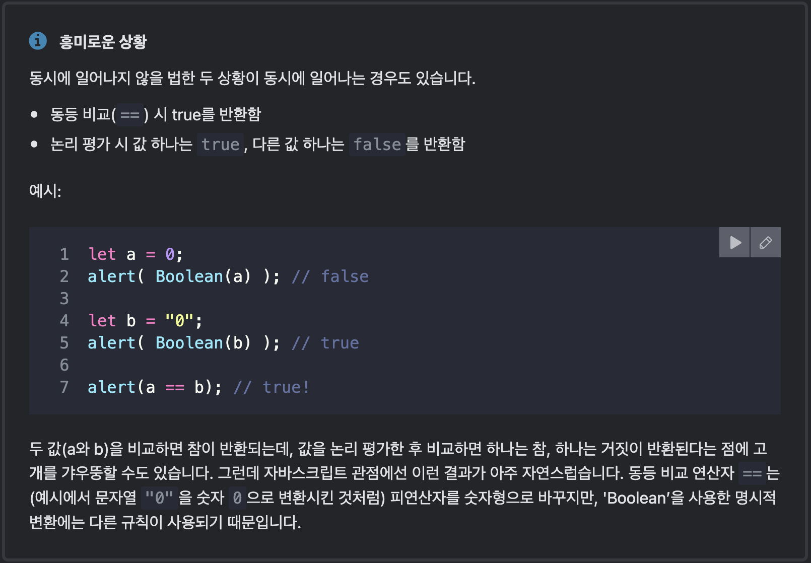

# 코어 자바스크립트

- [코드 구조](https://ko.javascript.info/structure)

  - 주석을 달면 코드의 전체적인 길이가 증가합니다. 하지만 이는 전혀 문제가 되지 않습니다. 프로덕션 서버에 배포하기 전에 코드를 압축해주는 도구가 많이 있고, 이 도구들은 주석을 삭제해주기 때문입니다. 실행 중인 스크립트엔 주석이 들어가지 않으므로, 주석은 최종으로 배포되는 코드에 부정적인 영향을 끼치지 않습니다.

- [엄격 모드](https://ko.javascript.info/strict-mode)

  - 자바스크립트는 꽤 오랫동안 호환성 이슈 없이 발전해왔습니다. 기존의 기능을 변경하지 않으면서 새로운 기능이 추가되었죠.
  - 덕분에 기존에 작성한 코드는 절대 망가지지 않는다는 장점이 있었습니다. 하지만 자바스크립트 창시자들이 했던 실수나 불완전한 결정이 언어 안에 영원히 박제된다는 단점도 생겼습니다.
  - 이런 상황은 ECMAScript5(ES5)가 등장하기 전인 2009년까지 지속되었습니다. 그런데 새롭게 제정된 ES5에서는 새로운 기능이 추가되고 기존 기능 중 일부가 변경되었습니다. 기존 기능을 변경하였기 때문에 하위 호환성 문제가 생길 수 있겠죠? 그래서 변경사항 대부분은 ES5의 기본 모드에선 활성화되지 않도록 설계되었습니다. 대신 use strict라는 특별한 지시자를 사용해 엄격 모드(strict mode)를 활성화 했을 때만 이 변경사항이 활성화되게 해놓았습니다.

- [변수와 상수](https://ko.javascript.info/variables)

  - 개발자 중에는 새로운 변수를 선언하기보다 기존 변수를 재사용 하는 걸 선호하는 게으른 분들이 있습니다.
    재사용된 변수는 과거에 붙여진 스티커를 떼지 않은 채 물건만 바뀐 상자와 같습니다. 상자 안에는 무엇이 들어 있을까요? 내용물에 대한 정보를 알고 있는 사람은 누구인가요? 이를 알기 위해선 상자에 가까이 다가가 확인해야만 합니다.
    변수를 재사용하면 변수 선언에 쏟는 노력을 좀 덜 순 있겠지만, 디버깅에 열 배 더 많은 시간을 쏟아야 합니다.
    `변수를 추가하는 것은 악습이 아닙니다. 좋은 습관입니다.
모던 자바스크립트 압축기(minifier)와 브라우저는 코드 최적화를 잘해줍니다. 변수를 추가한다고 해서 성능 이슈가 생기지 않죠. 값이 다른 경우, 변수를 다르게 선언해 주면 코드 최적화에 도움이 될 수도 있습니다.`

- [자료형](https://ko.javascript.info/types)

  - 자바스크립트에서 행해지는 수학 연산은 `안전`하다고 볼 수 있습니다. 0으로 나눈다거나 숫자가 아닌 문자열을 숫자로 취급하는 등의 이례적인 연산이 자바스크립트에선 가능합니다.
    말이 안 되는 수학 연산을 하더라도 스크립트는 치명적인 에러를 내뿜으며 죽지 않습니다. NaN을 반환하며 연산이 종료될 뿐입니다.
    - 0으로 나누는 경우에도 숫자에 대한 런타임 에러가 발생하는 대신 `infinity(type number)`를 리턴한다.

- [비교연산자](https://ko.javascript.info/comparison)

  
  

  - 동등 연산자와 일치 연산자의 차이
    - 동등 연산자는 형변환을 발생시킨다
    - 일치 연산자는 형변환을 발생시키지 않는다.

- [반복문](https://ko.javascript.info/while-for)

  

- [함수](https://ko.javascript.info/function-basics)

  
  

- [함수 표현식](https://ko.javascript.info/function-expressions)

  
